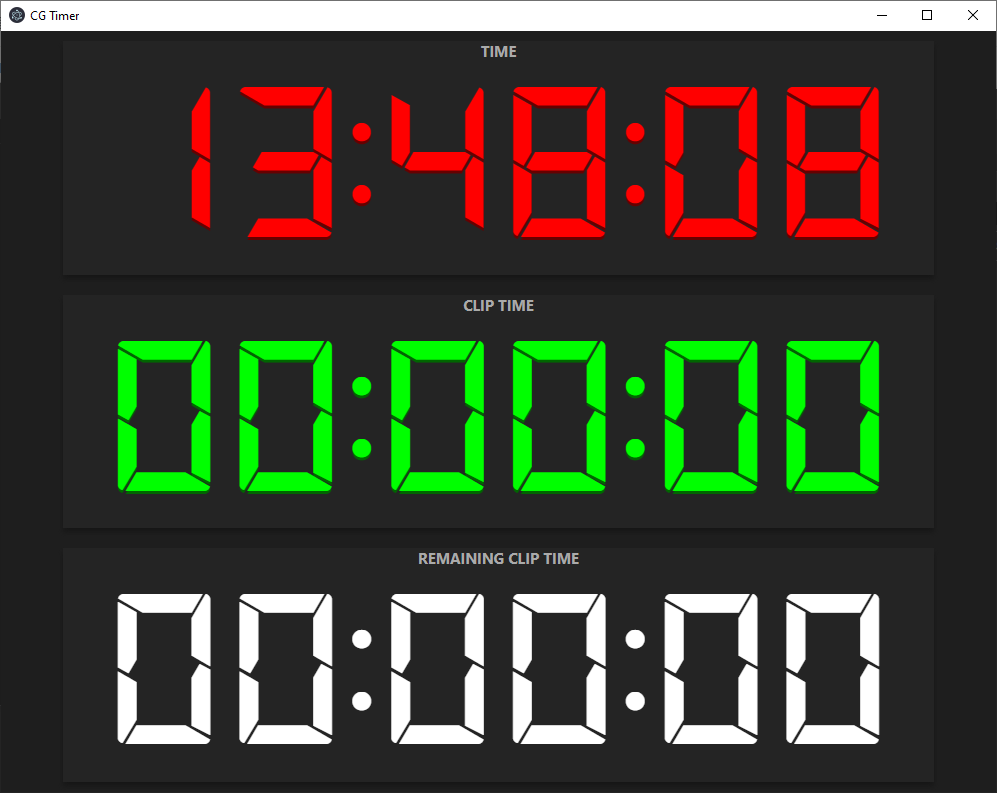
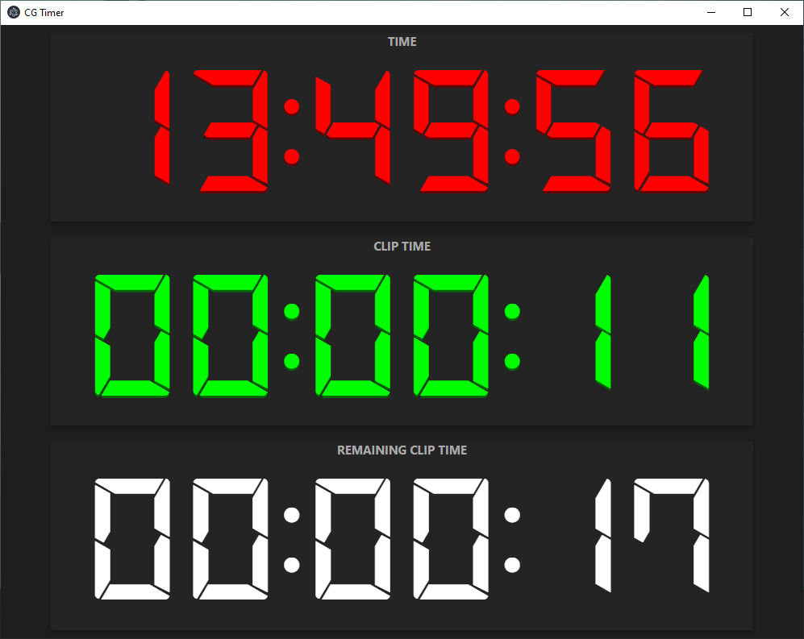

# CGTimer
CGTimer is an electron app to display current video time from a CasparCG server instance.  
It is heavily inspired on the looks of https://github.com/dimitry-ishenko-casparcg/timer.

# Screenshots




# Configuration
CGTimer expects a CasparCG server configured to output OSC data to port 6251.  
You can do this in you caspar.config:

```
  <osc>
    ...
    <predefined-clients>
      <predefined-client>
        <address>127.0.0.1</address>
        <port>6251</port>
      </predefined-client>
    </predefined-clients>
  </osc>
```

Replace 127.0.0.1 with the IP address of the machine running CGTimer.