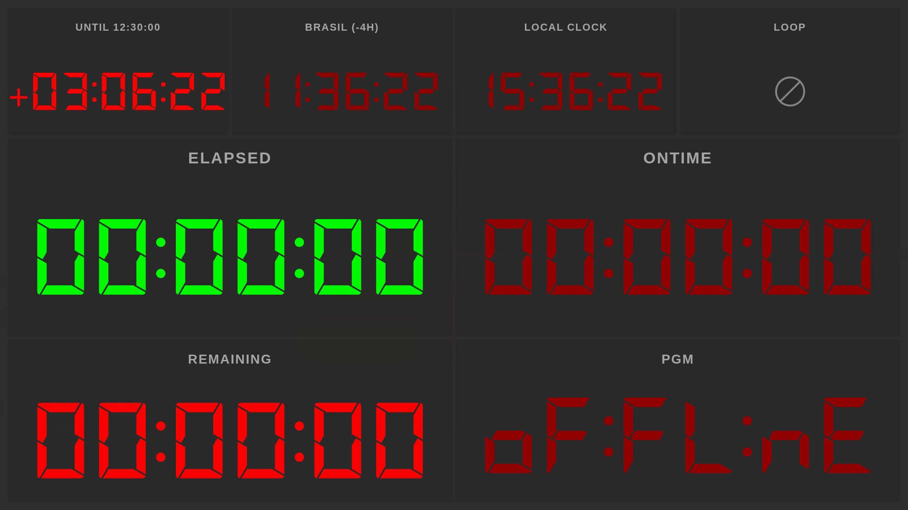

# CGTimer

Production clocks for CasparCG, Ontime, and Blackmagic HyperDeck — all in one
configurable, layout-driven dashboard.

CGTimer started as a media-time monitor for CasparCG playback and has grown
into a general-purpose **broadcast control room display**: drag and drop the
widgets you need, save the layout, and pull it up live during a show.

If you are using CGTimer, share some pictures and I'll open a gallery on the
wiki — [code@jcalado.com](mailto:code@jcalado.com).

> ☕ **Like CGTimer?** Buying me a coffee at
> [ko-fi.com/jcalado](https://ko-fi.com/jcalado) keeps the features coming.

## Screenshot



## What's new in 3.0

- **Drag-and-drop layout editor.** Split widgets left/right/up/down, resize
  panels, save multiple layouts and switch between them on the fly.
- **HyperDeck recorder widget.** Connect to one or more Blackmagic HyperDecks
  over the legacy text protocol (TCP/9993), see live `STBY` / `OFFLINE` /
  recording timecode with a recording indicator.
- **Ontime integration suite.** Five new widgets that mirror Ontime over OSC:
  current timer, event title, playback state, on-air indicator, and expected
  finish time.
- **Time-of-day countdown.** Counts down to a target wall-clock time
  (e.g., `20:00:00`); goes overdue with a `+` prefix.
- **World clocks.** Pin a configured timezone with a city label and live
  GMT offset.
- **Per-widget styling.** Custom label, foreground / background / label
  colors per widget, with reset.
- **OSC layout switching.** `/layout/load "Show A"` swaps the active layout
  remotely.
- **OSC-driven stopwatches.** Trigger named timers from OSC: `/timer/{name}/start`,
  `/stop`, `/reset`, `/toggle`, `/set <ms>`.
- **Fullscreen toggle.** Press `F` (or use the on-hover button) to enter
  fullscreen on the configured display.
- **Preferences shortcut.** `Cmd`/`Ctrl + ,` opens settings.
- **Portable Windows build.** A single `cgtimer-x.y.z.exe` portable binary is
  now produced alongside the NSIS installer.

## Widgets

| Group       | Widget                  | Notes                                                                |
|-------------|-------------------------|----------------------------------------------------------------------|
| Clocks      | World Clock             | Pick from a configured timezone list                                 |
| Clocks      | Local Clock             | Local system time                                                    |
| Playback    | Remaining Timer         | CasparCG remaining time (red under 10 s, blinks at end)              |
| Playback    | Elapsed Timer           | CasparCG elapsed time                                                |
| Playback    | Loop State              | Spinning loop icon while looping is active                           |
| Playback    | Now Playing             | Filename of the clip playing on the CasparCG layer                   |
| Playback    | Pause State             | Playing / paused / no-clip indicator for the CasparCG layer          |
| Playback    | Next Clip               | Clip cued via `LOADBG`; flashes `NOT CUED` as the playing clip ends  |
| Playback    | Clip Progress           | Progress bar for the playing clip                                    |
| Playback    | Channel Format          | Video mode and framerate of the CasparCG channel                     |
| Playback    | Server Health           | CasparCG AMCP connection, version and round-trip latency             |
| Timers      | Time-of-day Countdown   | Counts down to a target `HH:MM:SS`                                   |
| Timers      | OSC Timer               | Named stopwatch driven by `/timer/{name}/...` OSC commands           |
| Ontime      | Ontime Timer            | Mirrors `timer.current`                                              |
| Ontime      | Ontime Title            | Title of the currently running event                                 |
| Ontime      | Ontime Playback         | Play / Pause / Stop / Roll / Armed icon                              |
| Ontime      | Ontime On-Air           | `● LIVE` / `OFF` indicator, blinks while on-air                      |
| Ontime      | Ontime Expected Finish  | Wall-clock time the current event is expected to end                 |
| Recorders   | HyperDeck Recorder      | Live status + record timecode for a Blackmagic HyperDeck             |
| Recorders   | HyperDeck Media         | Remaining record capacity on a HyperDeck's active slot               |
| Recorders   | All Recorders           | `n/m REC` rollup across every HyperDeck, with offline warning        |
| Audio       | X32 Channel             | Mute state and name of an X32/M32 input channel                      |
| Audio       | X32 Meter               | Live input level meter (dB scale) for an X32/M32 channel             |
| Utility     | Variable Tile           | Shows any value pushed to `/display/{key}` over OSC                  |

## Configuration

### Open settings

Press `Alt` to reveal the menu, or `Cmd`/`Ctrl + ,` to jump straight to
**Preferences**. From there you can configure the OSC port and CasparCG
channel, pick the display, set default colors, and manage your timezones
and HyperDecks.

### CasparCG connection (AMCP)

Setting a **Server address** in Preferences opens an AMCP connection
(TCP/5250 by default) that powers the Server Health widget: reachability,
server version, and round-trip latency via `PING`. On CasparCG 2.4+ the
connection also issues `OSC SUBSCRIBE`, so the server streams OSC to
CGTimer with no `casparcg.config` changes. Older servers refuse the
command; the health widget then shows a `NO OSC PUSH` badge and you
configure the OSC target in `casparcg.config` as before. Leaving the
address empty disables the AMCP client entirely; OSC listening works
as always.

### Variable tiles

Any OSC sender can drive a **Variable Tile** by sending
`/display/{key} <value>` to CGTimer's OSC port; sending the address with
no arguments clears the tile. In Bitfocus Companion, add a generic OSC
instance pointed at CGTimer and a trigger like "on variable change, send
`/display/cam1 $(atem:input_1_name)`", and the tile becomes a live
readout for that variable. Arguments are joined with spaces, so multiple
values in one message work too.

### Companion feedback

Layouts are switchable from a Stream Deck by sending `/layout/load "Show A"`
from a Companion Generic OSC instance. To make the buttons light up with the
active layout, set the Companion address in **Preferences → Companion**:
CGTimer then pushes the active layout name to Companion's inbound OSC API
(`/custom-variable/cgtimer_layout/value`, port 12321 by default) on every
switch, on startup, and every 10 s as a keepalive. Create the custom
variable in Companion under **Variables → Custom**, then give each layout
button a **Check variable value** feedback comparing it to that button's
layout name. CGTimer also emits a generic `/layout/active "Show A"` to the
same target for non-Companion consumers.

### X32 / M32 mixer

Set the console address in **Preferences → Mixer** (OSC port 10023 by
default) to enable the X32 widgets. CGTimer subscribes with `/xremote`
and `/meters` and renews automatically; channel names, mute states and
fader levels come straight from the desk, so relabeling a channel on the
console updates the dashboard.

### Layout editor

In edit mode (toggle from the dock), drag widgets from the palette onto an
existing widget's edge to split it, click the splitter handles to resize, and
use the per-widget actions for split-right, split-down, color settings, or
remove. Save the result, give it a name, and duplicate / rename / delete from
the dock dropdown.

### CasparCG

CGTimer expects a CasparCG server configured to output OSC data. In
`caspar.config`:

```xml
<osc>
  ...
  <predefined-clients>
    <predefined-client>
      <address>127.0.0.1</address>
      <port>6251</port>
    </predefined-client>
  </predefined-clients>
</osc>
```

Replace `127.0.0.1` with the IP of the machine running CGTimer.

### Ontime

To show the active Ontime event timer (and the rest of the Ontime widgets):

1. In Ontime → **Integrations** → **OSC settings**, set **OSC Output** to on.
2. **OSC target IP**: the IP of the machine running CGTimer.
3. **OSC target port**: the same port CGTimer uses for CasparCG (e.g. `6251`).
4. Add OSC integrations cycling **every second**:

   | Address                          | Argument                |
   |----------------------------------|-------------------------|
   | `/from-ontime/current`           | `{{timer.current}}`     |
   | `/from-ontime/expectedFinish`    | `{{timer.expectedEnd}}` |
   | `/from-ontime/title`             | `{{eventNow.title}}`    |
   | `/from-ontime/playback`          | `{{playback}}`          |
   | `/from-ontime/onAir`             | `{{onAir}}`             |

### Blackmagic HyperDeck

In **Preferences → Recorders**, click **Add** and provide a label, host/IP,
and the HyperDeck's text-protocol port (default `9993`). CGTimer connects
over TCP, polls `transport info` continuously, and reflects the deck's
reported `display timecode` while recording.

### OSC control

| Address                                | Args              | Effect                                  |
|----------------------------------------|-------------------|-----------------------------------------|
| `/layout/load` or `/layout/select`     | `"Layout name"`   | Switch to the named saved layout        |
| `/timer/{name}/start`                  | —                 | Start a named OSC stopwatch             |
| `/timer/{name}/stop`                   | —                 | Stop                                    |
| `/timer/{name}/reset`                  | —                 | Reset to zero                           |
| `/timer/{name}/toggle`                 | —                 | Start/stop toggle                       |
| `/timer/{name}/set`                    | `<ms: number>`    | Set elapsed value in milliseconds       |

## Building from source

```bash
yarn install
yarn dev          # run in dev mode
yarn build        # type-check + bundle
yarn make:linux   # AppImage + .deb
yarn make:win     # NSIS installer + portable .exe
yarn make:mac     # .dmg + .zip
```

Releases are built via **GitHub Actions → Release app → Run workflow** after
bumping `package.json` version.

## Credits

The visual design is heavily inspired by
[dimitry-ishenko-casparcg/timer](https://github.com/dimitry-ishenko-casparcg/timer).
